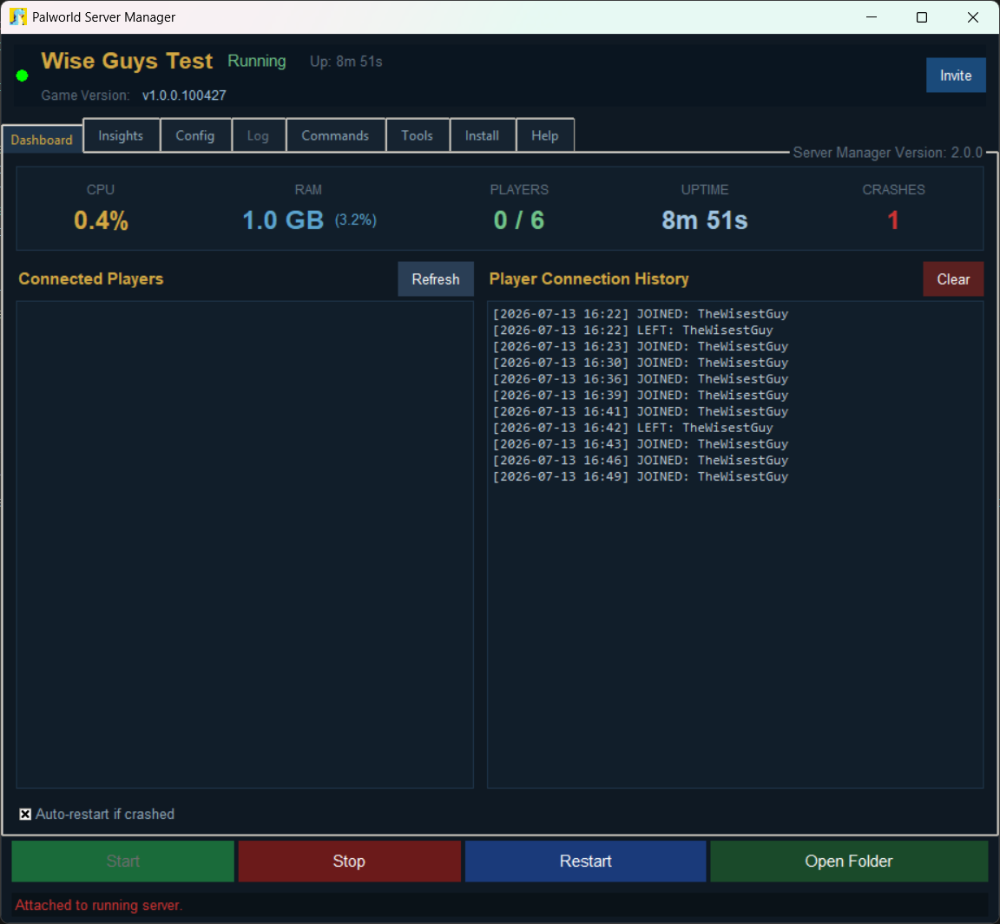
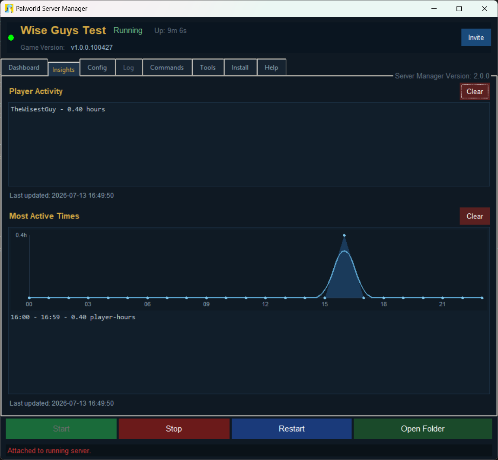
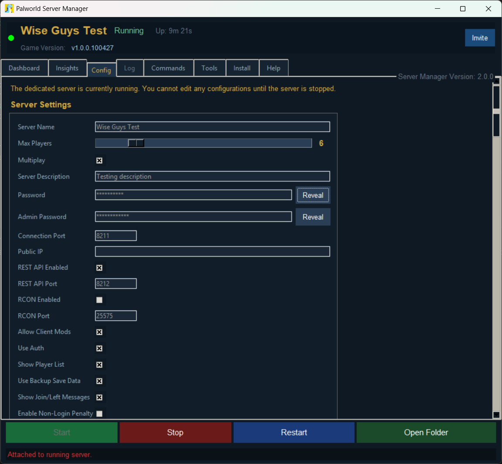
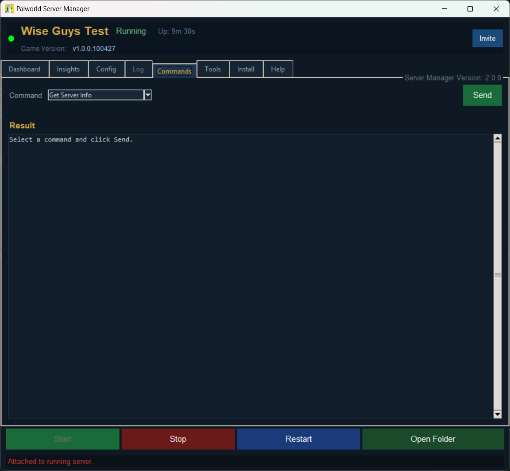
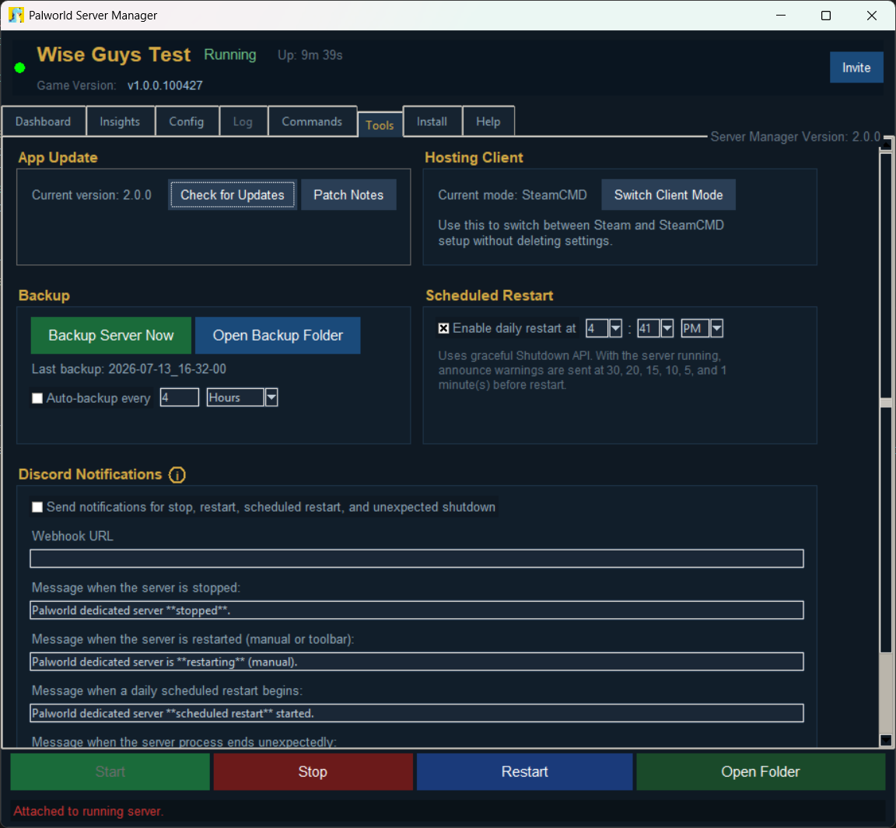
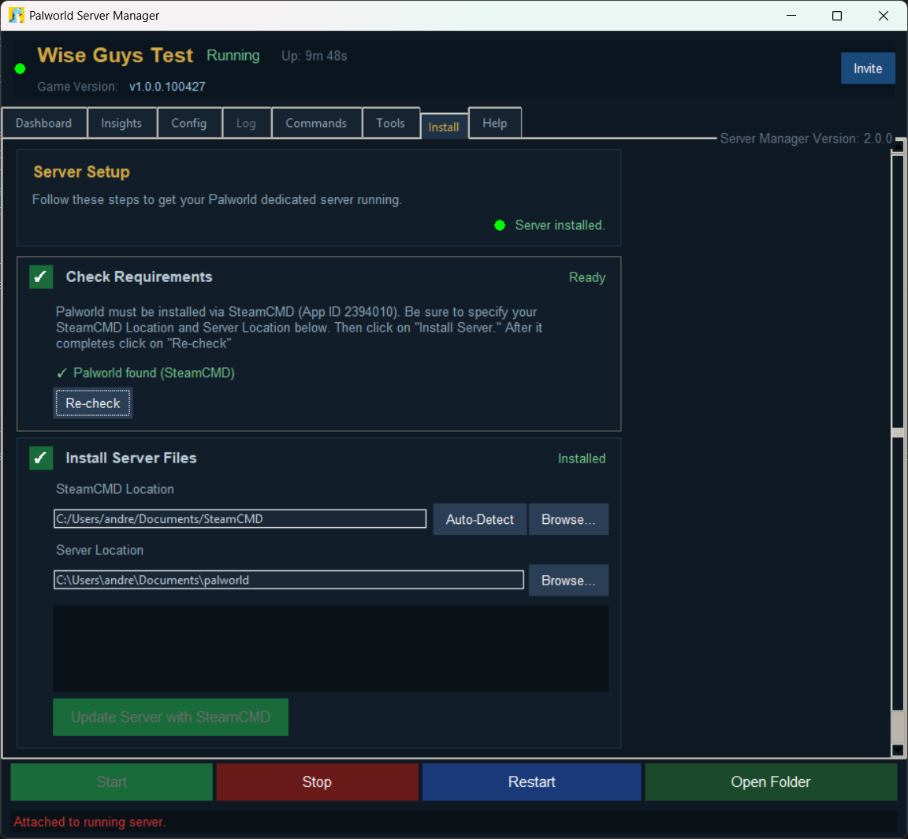

# Palworld Dedicated Server Manager

An open-source dedicated server manager for [Palworld](https://store.steampowered.com/app/1623730/Palworld/).

---

## Features

- **No Install Needed** — Just download and run the Server Manager
- **Steam and SteamCMD support** — Switch between install methods on demand
- **Guided Installation Wizard** — First-launch setup for Steam or SteamCMD
- **Discord Integration** — Webhook notifications for start, stop, restart, schedule, and crash events
- **One-click Start / Stop / Restart**
- **Automated game server updater**
- **Automated server manager updater**
- **Live dashboard** — CPU, RAM, player count, uptime, and connected player list via the Palworld REST API
- **Live Insights**
  - Player Activity — Individual player session totals
  - Most Active Times — 24-hour activity graph
- **REST API Support** — Send and receive all REST API commands and view them directly in the Server Manager
- **Live log viewer** — WIP
- **Config editor** — Edit `PalWorldSettings.ini` from the manager
- **Launch arguments** — Configure Palworld server startup flags
- **One-click world backup** — Timestamped save archives
- **Auto-backup** — Scheduled backups in hours or minutes
- **Scheduled daily restarts** - With automated messages prior to the restart
- **Auto-restart on crash**
- **Player history** — Persistent join/leave log

---

## Requirements

- Windows 10 or Windows 11
- Steam or SteamCMD
- Palworld Dedicated Server (Steam App ID `2394010`)

---

## How to Run

1. **Download the latest release** from [GitHub Releases](https://github.com/Andrew1175/Palworld-Dedicated-Server-Manager/releases/latest).
2. Extract the `.zip` to a folder of your choice. Keep all contents together:
   - `Palworld-Dedicated-Server-Manager.exe`
   - `_internal` (folder)
   - `palworld_logo.ico`
3. **Run `Palworld-Dedicated-Server-Manager.exe`**
4. Follow the Setup Wizard to configure a new dedicated server or use an existing install.
5. Click **Install Server** if using SteamCMD.
6. Open the **Dashboard** tab and click **Start**.

## REST API

You MUST enable the REST API for this Server Manager to function. This should be done automatically when you run the manager.

```ini
RESTAPIEnabled=True
RESTAPIPort=8212
AdminPassword="your-admin-password"
```

See the [Palworld REST API docs](https://docs.palworldgame.com/category/rest-api) for details.

---

## Screenshots

| Dashboard | Insights |
| --- | --- |
|  |  |

| Config | Commands |
| --- | --- |
|  |  |

| Tools | Install |
| --- | --- |
|  |  |

---

## Contributors

Original GUI design adapted from [Windrose Server Manager](https://github.com/psbrowand/Windrose-Server-Manager).